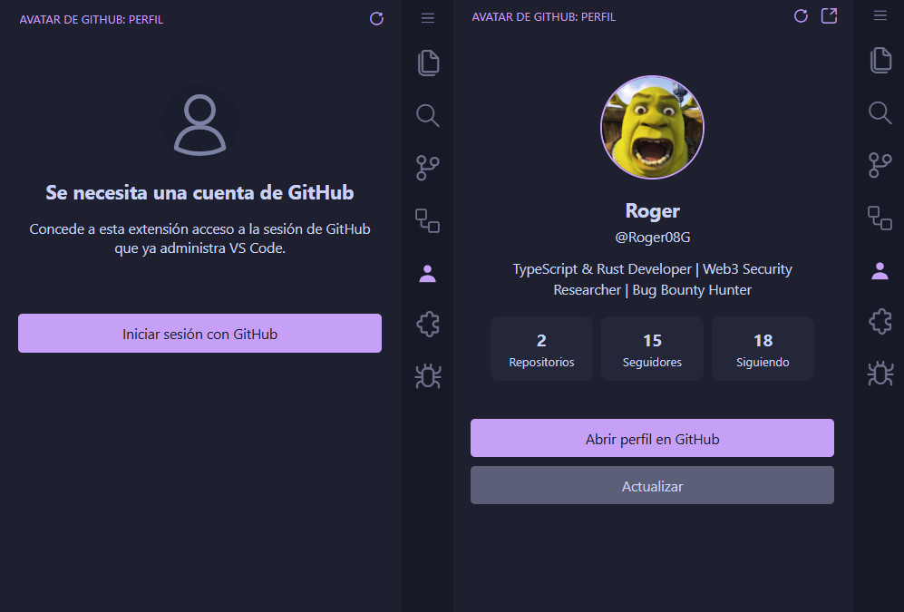

# Avatar de GitHub para VS Code

Muestra la cuenta de GitHub autenticada en VS Code como una tarjeta de perfil con el avatar real, los datos públicos del perfil y una entrada compacta en la barra de estado.



> VS Code no expone una API de extensión estable para reemplazar el icono **Cuentas** integrado en la esquina inferior izquierda. Este proyecto se mantiene dentro de las API compatibles: aporta una vista de perfil de GitHub en la barra lateral y muestra la cuenta actual en la barra de estado. No modifica archivos de VS Code, no inyecta CSS y no desactiva comprobaciones de integridad.

## Funcionalidades

- Usa el proveedor de autenticación de GitHub integrado en VS Code.
- Solicita consentimiento puntual antes de leer la sesión.
- Obtiene el perfil público y el avatar de la cuenta actual de GitHub.
- Muestra el avatar en una vista dedicada de la barra lateral.
- Añade una entrada clicable `@usuario` a la barra de estado.
- Se actualiza cuando cambian las sesiones de autenticación.
- Cachea los datos del perfil y el avatar como respaldo temporal sin conexión.
- Nunca almacena ni registra el token de acceso de GitHub.

## Requisitos

- VS Code `1.96.0` o superior.
- Node.js `20+` para las herramientas de desarrollo.
- Bun `1.3+` para dependencias y scripts.

## Desarrollo

```bash
bun install
bun run check
```

Abre el repositorio en VS Code y pulsa `F5` para iniciar un Extension Development Host.

Comandos útiles:

```bash
bun run dev          # observa y recompila
bun run test         # ejecuta las pruebas unitarias
bun run lint         # analiza TypeScript
bun run package:vsix # crea un VSIX instalable
```

## Flujo de autenticación

1. Abre la vista **Avatar de GitHub** en la barra lateral.
2. Selecciona **Iniciar sesión con GitHub**.
3. VS Code pregunta si la extensión puede usar la cuenta de GitHub que ya administra el editor.
4. La extensión llama al endpoint autenticado `/user` de GitHub y descarga el avatar.

El token sigue bajo control del proveedor de autenticación de VS Code. La extensión solo lo recibe en memoria para hacer la petición a la API.

## Estructura del proyecto

```text
.github/
  workflows/              CI y automatización de releases etiquetados
.vscode/                  Tareas de depuración de la extensión
media/                    Recursos del marketplace y de la vista
scripts/                  Scripts de mantenimiento multiplataforma
src/
  commands/               Registro de comandos
  github/                 Autenticación, cliente de API y caché
  services/               Orquestación del estado del perfil
  status/                 Integración con la barra de estado
  types/                  Tipos TypeScript compartidos
  utils/                  Ayudas para errores y HTML
  views/                  Proveedor de la webview del perfil
test/                     Pruebas unitarias
```

## Configuración

| Ajuste                       | Valor predeterminado | Descripción                                                           |
| ---------------------------- | -------------------: | --------------------------------------------------------------------- |
| `githubAvatar.showStatusBar` |               `true` | Muestra la cuenta de GitHub en la barra de estado.                    |
| `githubAvatar.cacheMinutes`  |                 `30` | Periodo durante el que la caché del perfil se considera reciente.     |
| `githubAvatar.autoRefresh`   |               `true` | Actualiza periódicamente el perfil mientras la extensión está activa. |

## CI y releases

- `CI` ejecuta comprobación de tipos, ESLint, Prettier, pruebas, compilación de producción y empaquetado VSIX en Linux, Windows y macOS.
- Al subir una etiqueta como `v0.1.0` se crea una GitHub Release con el VSIX generado.
- Dependabot vigila semanalmente las dependencias de npm y de GitHub Actions.

## Publicación

Actualiza lo siguiente antes de publicar:

- `publisher`, las URL del repositorio y los metadatos del Marketplace en `package.json`.
- `CHANGELOG.md` y la versión del paquete.
- La autenticación del publicador del Marketplace si publicas con `vsce publish`.

## Seguridad y privacidad

Consulta [SECURITY.md](./SECURITY.md). No incluyas tokens de acceso en incidencias, capturas, registros ni fixtures de pruebas.

## Licencia

MIT © 2026 Roger08G
